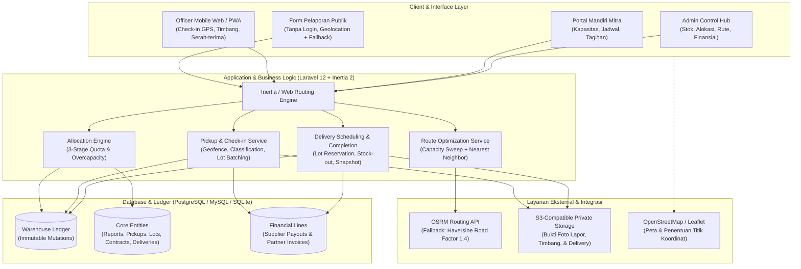
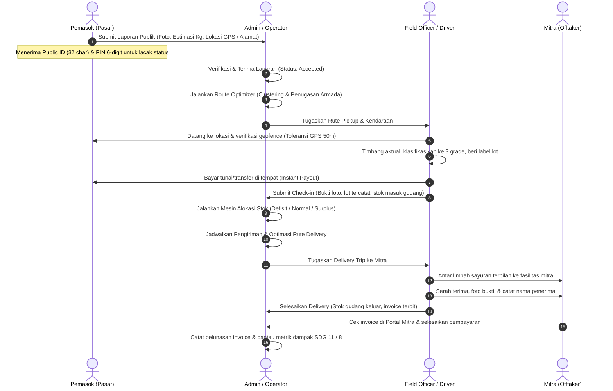
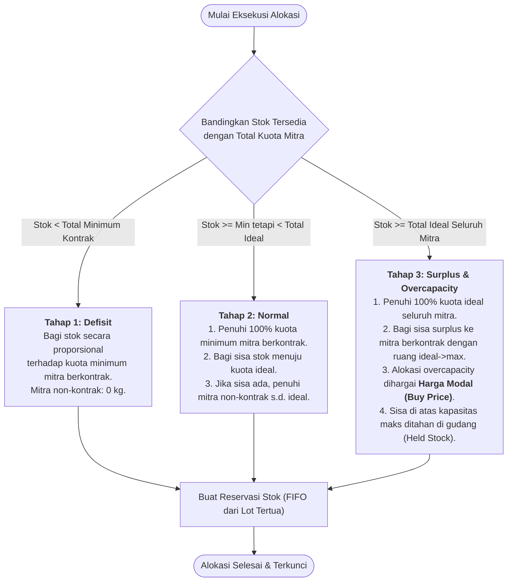

# SayCle — Circular Vegetable Waste Supply Chain Platform

[](https://laravel.com/)
[](https://inertiajs.com/)
[](https://react.dev/)
[](https://www.typescriptlang.org/)
[](https://tailwindcss.com/)
[](https://vitejs.dev/)
[](https://developer.mozilla.org/en-US/docs/Web/Progressive_web_apps)

SayCle adalah platform manajemen rantai pasok sirkular (*circular supply chain operations*) untuk limbah sayuran organik perkotaan. Platform ini menghubungkan pasar tradisional dan pedagang lokal yang memiliki sisa sayuran organik dengan petugas lapangan (*field officers*), mengelola gudang transit dan pemilahan, serta mendistribusikan material terpilah secara terukur ke mitra pengolah (*offtakers*) pakan ternak, budidaya maggot (BSF), dan fasilitas kompos.

Model bisnis SayCle didasarkan pada margin per transaksi penjualan material terpilah, bukan model langganan SaaS murni. Platform ini dibingkai dengan komitmen dampak:
- **Fokus Utama — SDG 11 (Sustainable Cities and Communities)**: Mengalihkan tonase limbah sayuran organik dari TPA perkotaan ke pemanfaatan kembali secara produktif.
- **Dampak Pendukung — SDG 8 (Decent Work and Economic Growth)**: Memberikan pendapatan tambahan langsung bagi pemasok lokal serta menciptakan lapangan kerja operasional yang layak dan terstruktur.

---

##  Arsitektur Sistem

SayCle dibangun sebagai aplikasi monolitik modern menggunakan arsitektur **Laravel 12 + Inertia.js v2 + React 19**, dilengkapi dengan kemampuan PWA (*Progressive Web App*) untuk kebutuhan operasional kurir/officer di lapangan.



---

##  Peran Pengguna & Alur Kerja (*User Flows*)

SayCle memiliki 4 peran pengguna dengan kebutuhan operasional yang saling terintegrasi:



### 1. Pemasok (Pasar / Pedagang Lokal)
- **Tanpa Akun / No Login**: Melapor langsung melalui formulir web publik `/lapor` yang ringan dan responsif.
- **Deteksi Lokasi Cerdas**: Mengambil koordinat GPS peramban dengan izin eksplisit. Jika GPS tidak aktif atau ditolak, tersedia opsi alamat manual dengan *auto-geocoding* area perkotaan.
- **Pelacakan Aman (*Zero-Knowledge Tracking*)**: Setiap laporan menghasilkan `public_id` unik (32 karakter) dan `PIN` 6 digit. Status transaksi hanya dapat dibuka jika memasukkan ID dan PIN yang valid di `/tracking`.

### 2. Field Officer / Kurir Lapangan
- **Aplikasi Mobile-First & PWA**: Dirancang untuk kemudahan operasional di lapangan dengan dukungan PWA offline app shell.
- **Validasi Geofencing**: Check-in pickup memvalidasi jarak koordinat petugas dengan titik lapor (toleransi default 50 meter).
- **Penimbangan & Klasifikasi Multi-Grade**: Menimbang dan menginput bobot fisik per grade. Sistem memvalidasi bahwa total berat fisik harus sama persis dengan akumulasi bobot per grade.
- **Pembayaran di Tempat (*Cash-on-Pickup*)**: Petugas langsung mencatat pembayaran pemasok dengan harga beli snapshot saat penimbangan, yang otomatis tercatat lunas pada buku kas operasional.
- **Penanganan Penolakan Pemasok (*Supplier Rejection*)**: Jika pemasok membatalkan transaksi atau sayuran tidak sesuai, petugas dapat memproses penolakan dengan alasan terverifikasi dan foto bukti penolakan.

### 3. Mitra (*Offtakers*)
- **Profil Kapasitas & Cadence**: Menetapkan kapasitas mingguan dalam 3 tingkatan: `min_capacity_kg`, `ideal_capacity_kg`, dan `max_capacity_kg`, serta preferensi frekuensi pengiriman (Harian, Mingguan pada hari tertentu, atau Bulanan).
- **Persetujuan Ketentuan Overcapacity**: Menyetujui klausul penyerapan limbah berlebih dengan harga modal saat registrasi atau login pertama kali, sehingga proses serah-terima surplus tidak membutuhkan approval ulang per pengiriman.
- **Portal Mandiri (*Partner Portal*)**: Memantau kontrak aktif, riwayat pengiriman material, dan tagihan invoice (`/partner/deliveries`, `/partner/contract`, `/partner/billing`).

### 4. Admin / Operator
- **Pusat Kendali Laporan**: Meninjau laporan masuk, melihat foto bukti, serta menyetujui (*accept*) atau menolak (*reject*) laporan.
- **Inventaris & Manajemen Multi-Gudang**: Memantau stok fisik per grade secara real-time dari buku besar mutasi, mengelola gudang transit, dan melakukan penyesuaian stok (*adjustment*) jika ada susut bobot.
- **Optimasi Rute Berjenjang**:
  - *Pickup Routing*: Mengelompokkan titik penjemputan dari laporan yang diterima berdasarkan kapasitas armada kendaraan.
  - *Delivery Routing*: Mengelompokkan titik pengiriman mitra berdasarkan jadwal pengiriman dan reservasi lot.
- **Mesin Alokasi Stok Otomatis**: Mendistribusikan stok gudang ke mitra berdasarkan kontrak aktif dan aturan keadilan kuota.
- **Snapshot Finansial & Dampak**: Melacak margin transaksi, pelunasan tagihan mitra, serta metrik dampak lingkungan SDG 11 & SDG 8.

---

##  *Core Business Logic*

### 1. Klasifikasi 3-Grade Tetap (*Immutable Three-Grade System*)
SayCle menerapkan klasifikasi material yang ketat dan tidak boleh diubah atau ditukar sepanjang rantai pasok:

| Grade | Kriteria Fisik | Tujuan Pemanfaatan (`intended_use`) | Mitra Target |
| :--- | :--- | :--- | :--- |
| **`Layak`** | Sayuran segar sisa pasar, tidak busuk, bersih dari kontaminan fisik | `pakan_ternak` | Peternakan sapi, kambing, unggas |
| **`Kurang Layak`** | Mulai layu, fermentasi ringan, memar, tidak berbau busuk tajam | `maggot` | Fasilitas budidaya larva lalat BSF |
| **`Tidak Layak`** | Busuk, berlendir, rusak parah, tidak layak pakan | `kompos` | Fasilitas pengolahan pupuk organik |

> **Prinsip**: Jika terjadi kelebihan pasokan (*overcapacity*), material tidak pernah diubah gradenya. Grade `Layak` tetap disalurkan untuk pakan ternak atau mitra kompos cadangan dengan identitas grade asal tetap tersimpan di buku besar.

---

### 2. Mesin Alokasi Stok 3 Tahap (*Three-Stage Allocation Engine*)

Setiap kali operator mengeksekusi alokasi harian (`POST /allocation/run`), sistem mengevaluasi stok yang tersedia (*unreserved physical stock*) dan menjalankan 3 tahapan alokasi:



1. **Tahap 1 — Defisit (`available_stock < total_min_contract`)**:
   - Seluruh stok dialokasikan secara proporsional terhadap kuota minimum mitra berkontrak aktif.
   - Mitra tanpa kontrak tidak mendapatkan alokasi pada kondisi defisit.
2. **Tahap 2 — Normal (`total_min_contract <= available_stock < total_ideal_all`)**:
   - Memenuhi 100% kuota minimum seluruh mitra berkontrak.
   - Sisa stok dibagikan secara proporsional untuk menutup selisih menuju kuota ideal (*ideal headroom*).
   - Jika mitra berkontrak telah mencapai kuota ideal dan masih ada sisa stok, material disalurkan ke mitra non-kontrak hingga kuota ideal mereka terpenuhi.
3. **Tahap 3 — Surplus & Overcapacity (`available_stock >= total_ideal_all`)**:
   - Memenuhi 100% kuota ideal seluruh mitra (berkontrak dan non-kontrak).
   - Sisa stok di atas kuota ideal dialokasikan sebagai **Overcapacity** ke mitra berkontrak yang memiliki ruang kapasitas antara ideal hingga maksimum (`ideal_capacity_kg` &rarr; `max_capacity_kg`).
   - **Klausul Finansial**: Bagian kuota overcapacity ini ditagihkan ke mitra dengan **Harga Modal (Cost Price / Buy Price)** agar seluruh sampah organik pasar tetap terserap tuntas tanpa membebani mitra.
   - Sisa stok di atas kapasitas maksimum seluruh mitra tidak dipaksakan keluar, melainkan ditahan secara transparan (*held stock*) di gudang untuk dialihkan ke mitra kompos cadangan pada siklus berikutnya.

---

### 3. Buku Besar Mutasi Gudang (*Double-Entry Warehouse Ledger*)

Inventaris gudang dikelola secara imutabel melalui tabel `warehouse_mutations` (tidak ada manipulasi angka stok secara langsung):
- **`receipt`**: Dibuat otomatis saat petugas menyelesaikan penimbangan di lapangan (`PickupCheckinService`), mengikat `classification_lot_id`.
- **`stock_out`**: Dibuat otomatis saat pengiriman ke mitra diselesaikan (`DeliveryCompletionService`), mengikat baris pengiriman `delivery_trip_lines`.
- **`adjustment`**: Penyesuaian manual oleh admin jika terjadi penyusutan alami, kerusakan, atau hasil *stock-opname*.

---

### 4. Snapshot Finansial & Ketertelusuran (*Traceability*)

Untuk menjaga validitas audit finansial dan dampak:
- **Harga Historis Imutabel**: Harga satuan (*unit price*) pembelian dari pemasok dan penjualan ke mitra disalin (*snapshot*) ke baris transaksi (`financial_lines` dan `delivery_lines`) saat kejadian berlangsung. Perubahan daftar harga di masa depan tidak akan memengaruhi laporan keuangan atau invoice masa lalu.
- **Audit Trail Ketertelusuran (Provenance)**: Setiap kilogram material yang diterima mitra dapat dilacak mundur hingga ke:
  `Laporan Pemasok` &rarr; `Titik Pickup` &rarr; `Lot Klasifikasi` &rarr; `Mutasi Gudang` &rarr; `Reservasi Alokasi` &rarr; `Trip Pengiriman` &rarr; `Invoice & Bukti Serah-Terima`.

---

##  Mesin Status (*State Machines*)

### Siklus Laporan & Penjemputan Pemasok
```
[submitted] ──(Admin Accept)──> [accepted] ──(Route Optimize)──> [pickup_scheduled]
     │                                                                 │
     └──(Admin Reject)──> [rejected]                                   ▼
                                                                 [in_progress]
                                                                  │         │
                                              (Officer Checkin)───┘         └──(Supplier Tolak)
                                                      ▼                                  ▼
                                                 [picked_up]                    [supplier_rejected]
```

### Siklus Pengiriman & Trip Mitra
```
[planned] ──(Jadwalkan Delivery)──> [assigned] ──(Mulai Perjalanan)──> [in_transit]
                                                                             │
                                                     (Selesai Serah-Terima)──┘
                                                                ▼
                                                           [delivered]
```

---

##  Panduan Menjalankan Project

Anda dapat menjalankan project ini dengan dua cara: **secara lokal langsung (tanpa Docker)** untuk performa maksimal, atau **menggunakan Docker Compose**.

### Opsi 1: Menjalankan Secara Lokal (Tanpa Docker) — *Direkomendasikan*

#### 1. Prasyarat Sistem
- **PHP**: Versi `>= 8.2` (dengan ekstensi aktif: `intl`, `pdo_pgsql` atau `pdo_mysql`, `fileinfo`, `curl`, `mbstring`, `openssl`).
- **Composer**: Versi `>= 2.0`.
- **Node.js**: Versi `>= 20.x` dan **npm**.
- **Database**: PostgreSQL versi `>= 14` atau MySQL versi `>= 8.0` (atau SQLite untuk uji coba cepat).

#### 2. Instalasi Dependensi
```bash
# Clone repository
git clone https://github.com/saycle-hub/sayclev2.git
cd sayclev2

# Install dependensi backend PHP
composer install

# Install dependensi frontend React/Node
npm install
```

#### 3. Konfigurasi Environment (`.env`)
Salin file konfigurasi environment dan buat encryption key aplikasi:
```bash
cp .env.example .env
php artisan key:generate
```

Sesuaikan koneksi database di file `.env`. Contoh untuk **PostgreSQL**:
```env
APP_NAME=Saycle
APP_ENV=local
APP_DEBUG=true
APP_URL=http://localhost:8001

DB_CONNECTION=pgsql
DB_HOST=127.0.0.1
DB_PORT=5432
DB_DATABASE=saycle
DB_USERNAME=postgres
DB_PASSWORD=your_password

SESSION_DRIVER=database
CACHE_STORE=database
QUEUE_CONNECTION=database
FILESYSTEM_DISK=local
```

*(Catatan: Untuk penyimpanan foto bukti di lokal tanpa AWS S3, set `FILESYSTEM_DISK=local`)*.

#### 4. Migrasi Database & Seeding Data Awal
Jalankan migrasi tabel beserta dataset seeder awal:
```bash
php artisan migrate --seed
```

#### 5. Menjalankan Server Aplikasi
Jalankan backend Laravel dan dev server Vite secara berdampingan. Anda dapat menentukan port non-default sesuai kebutuhan (misal port `8001` untuk Laravel dan `5174` untuk Vite):

**Terminal 1 — Backend Laravel:**
```bash
php artisan serve --port=8001
```

**Terminal 2 — Frontend Vite HMR:**
```bash
npm run dev
```

Buka browser Anda dan akses:
 **[http://localhost:8001](http://localhost:8001)**

---

### Opsi 2: Menjalankan Menggunakan Docker

Jika Anda ingin menjalankan seluruh ekosistem (PHP-FPM, Nginx, MySQL, Redis) di dalam container:

```bash
# Salin konfigurasi environment docker
cp .env.docker .env

# Jalankan container di latar belakang
docker-compose up -d --build

# Jalankan migrasi dan seeding di dalam container
docker-compose exec app php artisan migrate --seed
```

Aplikasi dapat diakses melalui web browser di:
 **[http://localhost:8888](http://localhost:8888)**

---

##  Kredensial Akun Pengujian (*Demo Seed Accounts*)

Database seeder (`DatabaseSeeder`) telah menyiapkan akun default untuk masing-masing peran pengguna dengan password bawaan: `password123`.

| Peran | Nama Pengguna / Deskripsi | Alamat Email | Password |
| :--- | :--- | :--- | :--- |
| **Admin Utama** | Administrator Operasional SayCle | `admin@saycle.id` | `password123` |
| **Field Officer** | Bambang Haryanto (Koordinator Ops) | `officer@saycle.id` | `password123` |
| **Driver Armada 1** | Budi Santoso (PickUp L300) | `driver1@saycle.id` | `password123` |
| **Driver Armada 2** | Agus Setiawan (Box Isuzu Elf) | `driver2@saycle.id` | `password123` |
| **Mitra Kompos** | PT Kompos Organik Sentolo Jogja | `mitra.composter@saycle.com` | `password123` |
| **Mitra Maggot** | CV Maggot Farm BSF Banguntapan | `mitra.maggot@saycle.com` | `password123` |
| **Mitra Pakan** | Kelompok Ternak Lembu Makmur Sleman | `mitra.ternak@saycle.com` | `password123` |

---

##  Dokumentasi Endpoint Kunci

### 1. Pelaporan & Pelacakan Publik (Tanpa Autentikasi)

#### `POST /lapor`
Mengirimkan formulir penawaran limbah sayuran dari pedagang pasar.
- **Header**: `Content-Type: multipart/form-data`
- **Payload**:
  - `contact` *(string, wajib)*: Nama pemasok / kios pasar.
  - `estimate_kg` *(numeric, wajib)*: Perkiraan berat sayuran (kg).
  - `photo` *(file image, wajib)*: Foto kondisi tumpukan sayuran.
  - `latitude` *(float, opsional)*: Titik lintang koordinat GPS.
  - `longitude` *(float, opsional)*: Titik bujur koordinat GPS.
  - `manual_address` *(string, opsional)*: Alamat manual jika GPS tidak tersedia.
- **Hasil**: Redirect ke halaman sukses Inertia dengan data `public_id` dan `pin`.

#### `POST /tracking/show`
Melacak perkembangan penjemputan laporan menggunakan ID dan PIN.
- **Payload**: `public_id` *(string)*, `pin` *(string, 6 digit)*.
- **Hasil**: Data status laporan, kendaraan/driver yang ditugaskan, dan rincian penimbangan akhir setelah check-in.

---

### 2. Operasional Lapangan Officer (`role:officer`)

#### `POST /officer/pickups/{pickup}/checkin`
Mencatat hasil penimbangan akhir, klasifikasi multi-grade, dan pelunasan bayar di lokasi pemasok.
- **Header**: `Content-Type: multipart/form-data`
- **Payload**:
  - `actual_total_kg` *(numeric, wajib)*: Total berat aktual terukur.
  - `grades` *(array, wajib)*: Rincian bobot per grade, contoh:
    `[{"grade": "Layak", "kg": 30.5}, {"grade": "Kurang Layak", "kg": 15.0}]`
  - `checkin_lat` *(float, wajib)*: Koordinat GPS saat melakukan check-in.
  - `checkin_lng` *(float, wajib)*: Koordinat GPS saat melakukan check-in.
  - `photo` *(file image, wajib)*: Foto timbangan digital / bukti serah-terima.
  - `supplier_rejected` *(boolean, opsional)*: Diisi `true` jika pemasok membatalkan transaksi.
  - `refusal_reason` *(string, opsional)*: Wajib jika `supplier_rejected` bernilai `true`.

#### `POST /officer/deliveries/{trip}/complete`
Mencatat penyelesaian pengiriman material ke fasilitas mitra.
- **Header**: `Content-Type: multipart/form-data`
- **Payload**:
  - `photo` *(file image, wajib)*: Foto bukti serah-terima material di lokasi mitra.
  - `recipient_name` *(string, opsional)*: Nama perwakilan mitra yang menerima.
  - `notes` *(string, opsional)*: Catatan kondisi penerimaan.

---

### 3. Kendali Operasi Admin (`role:admin`)

#### `POST /allocation/run`
Mengeksekusi mesin alokasi stok 3 tahap untuk mendistribusikan stok gudang ke kontrak mitra aktif.
- **Payload**: `date` *(string, YYYY-MM-DD, opsional — default hari ini)*.

#### `POST /routes/optimize`
Mengelompokkan seluruh laporan pemasok yang berstatus `accepted` ke armada aktif menggunakan algoritma *Capacity-Aware Sweep + Nearest Neighbor*.

#### `POST /delivery-routes/optimize`
Mengelompokkan reservasi pengiriman mitra ke armada kendaraan aktif berdasarkan rute efisien dan kapasitas angkut.

#### `POST /stock/adjust`
Melakukan penyesuaian manual stok gudang (misal terjadi penyusutan alami atau kalibrasi timbangan).
- **Payload**: `warehouse_id` *(int)*, `grade` *(Layak|Kurang Layak|Tidak Layak)*, `type` *(in|out|adjust)*, `kg` *(numeric)*, `description` *(string)*.

#### `POST /partner-invoices/{invoice}/pay`
Mencatat konfirmasi pelunasan tagihan invoice dari mitra pengolah.
- **Payload**: `paid_at` *(date)*, `notes` *(string)*.

---

##  Pengujian & Kualitas Kode

Jalankan rangkaian unit & feature test untuk memastikan seluruh business logic berjalan stabil:

```bash
# Menjalankan seluruh pengujian PHPUnit
php artisan test

# Menjalankan linter & static analysis
npm run lint

# Memeriksa format kode frontend
npm run format:check
```

---

